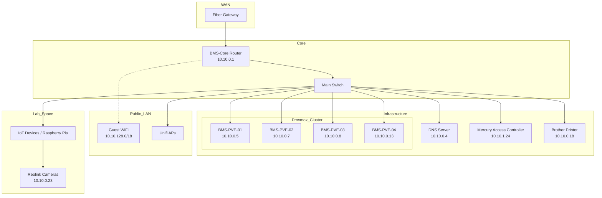

# BMS Network Map (10.10.0.0/16)

This diagram represents the logical layout of the Bellingham Makerspace LAN.

## Critical Segments
- **Infrastructure (10.10.0.0/24):** Core routers, servers, and fixed infrastructure.
- **Office/Management (10.10.1.0/24):** Office machines, printers, and door access.
- **Dynamic DHCP (10.10.2.0 - 10.10.63.255):** Member devices and wired connections.
- **WiFi Clients (10.10.64.0/18):** Wireless users and mobile devices.

---
*Related: [[Network/Networks/BMS/index]]*
